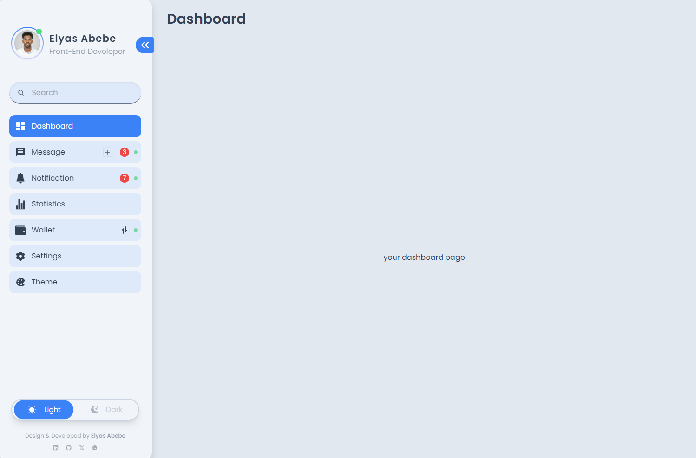

# Animated and Responsive Sidebar

[](https://reactjs.org/)
[](https://redux.js.org/)
[](https://www.typescriptlang.org/)
[](https://tailwindcss.com/)
[](https://react-icons.github.io/react-icons/)

A fully responsive and animated sidebar for web pages, implemented using React Vite, Redux, TypeScript, Tailwind CSS, and React Icons.

<div align="center" style="border-radius: 50%;">
  
</div>

<p align="center">
  Elyas (Elijah) Abebe
</p>
<p align="center">
  Front-End Web App Developer
</p>

### Here's a screenshot of the animated and responsive sidebar in action:



## Features

- Smooth animations for seamless user experience.
- Fully responsive design to ensure compatibility across various devices.
- Customizable color palette to match your website's theme.
- Dark and night themes for better accessibility and user preference.

## Demo

[Link to live demo](https://responsive-sidebar-ella.vercel.app/)

## Installation

To install and run this sidebar locally, follow these steps:

1. Clone this repository.
2. Install dependencies using `npm install`.
3. Run the development server using `npm run dev`.

## Usage

Once the development server is running, you can integrate the sidebar into your project by importing it as a component and passing necessary props.

```jsx
import React from "react";
import Sidebar from "./Sidebar";

function App() {
  return (
    <div className="flex">
      <Sidebar />
      {/* Your main content here */}
    </div>
  );
}

export default App;
```
